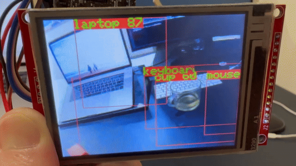

# Projects for Realtek AMB82-Mini IoT AI Camera Board

## *AMB82 MINI*

[Specifications]
* MCU: ARMv8M up to 500 MHz
* NPU: Intelligent Engine at 0.4 TOPS
* Memory: internal DDR2 128 MB on SoC and 16 MB external SPI Nor flash on Dev. Board
* Wi-Fi: 802.11 a/b/g/n 1x1, Dualband 2.4GHz/5GHz Wi-Fi, Wi-Fi simple config
Bluetooth: BLE 5.1
* Security: Hardware cryptographic engine, Secure boot (optional), Trust-Zone (optional), Wi-Fi WEP, WPA, WPA2, WPA3, WPS
* Audio Codec: ADC/DAC/I2S
* ISP/Video: HDR / 3DNR / WDR ; H264/H265/JPEG video encoder 1080p@30fps +720p@30fps
* Camera module: JXF37 1920 x 1080 full HD CMOS image sensor with wide view angle FOV 130° optical lens
* Interface: 1 Microphone on Dev Board, 2 Micro USB_B, 1 MicroSD card slot, 2 tact switch button, 3 UART, 2 SPI, 1 I2C, 8 PWM, 2 GDMA, Max. 23 GPIOs

### Getting started it from Arduino IDE

> You can refer to this link to get started: https://www.amebaiot.com/en/amebapro2-amb82-mini-arduino-getting-started
> , or follow the steps below.

1. **Add Ameba Arduino SDK link to *Arduino IDE Additional Boards Manager***

    > Arduino IDE 1.6.5 and above versions support third party hardware so please make sure to use the latest Arduino IDE for better experience.

    Therefore, you need to add Ameba Arduino SDK link in 
    
    **"File" -> "Preferences" -> "Additional Boards Manager URLs:"**

    Copy and paste the following link into the field and click "OK",

    https://github.com/ambiot/ambpro2_arduino/raw/main/Arduino_package/package_realtek_amebapro2_index.json

    > We also suggest to enable "Show verbose output" options on "compilation" and "upload" in Preference for easier debugging.
    
     

2. **Install Ameba board in *"Board Manager"***

    Open **"Tools" -> "Board" -> "Board Manager"**, wait for it to update additional hardware configurations, then type **"ameba"** in the search bar, you will see Realtek Ameba in the list.

    Press **"Install"** to start the installation.
    
     

3. **Select your Ameba model in *"Tools" -> "Board" -> "AmebaPro2 ARM (32-bits) Boards"***

    > Make sure you select the correct model for your board, otherwise your program might not work properly 

    Now you are **ready** to develop and upload firmware onto Ameba.

    For more information, please refer to https://www.amebaiot.com/en/ameba-arduino-summary/
    
     

### Object detection that running in stand-alone (Yolo v7 Tiny)

0. Libraries required
    > **Arduino TJpg_Decoder library** https://github.com/Bodmer/TJpg_Decoder

    To draw the JPEG image buffer to the display, we need to decode it. Unfortunately, it does not yet support the "Ameba Pro 2" architecture, so you need to modify the User_Config.h file for a successful build.

    > open "/src/User_Config.h"
    
    > remove "#define TJPGD_LOAD_SD_LIBRARY"

1. Load source code
   > Get the demo source code from ths src folder.

   > Open src/Standalone_Object_Detector_v1 in your Arduino IDE.
   

### MIT License

Copyright (c) 2024 Eric Nam

Permission is hereby granted, free of charge, to any person obtaining a copy
of this software and associated documentation files (the "Software"), to deal
in the Software without restriction, including without limitation the rights
to use, copy, modify, merge, publish, distribute, sublicense, and/or sell
copies of the Software, and to permit persons to whom the Software is
furnished to do so, subject to the following conditions:

The above copyright notice and this permission notice shall be included in all
copies or substantial portions of the Software.

THE SOFTWARE IS PROVIDED "AS IS", WITHOUT WARRANTY OF ANY KIND, EXPRESS OR
IMPLIED, INCLUDING BUT NOT LIMITED TO THE WARRANTIES OF MERCHANTABILITY,
FITNESS FOR A PARTICULAR PURPOSE AND NONINFRINGEMENT. IN NO EVENT SHALL THE
AUTHORS OR COPYRIGHT HOLDERS BE LIABLE FOR ANY CLAIM, DAMAGES OR OTHER
LIABILITY, WHETHER IN AN ACTION OF CONTRACT, TORT OR OTHERWISE, ARISING FROM,
OUT OF OR IN CONNECTION WITH THE SOFTWARE OR THE USE OR OTHER DEALINGS IN THE
SOFTWARE.